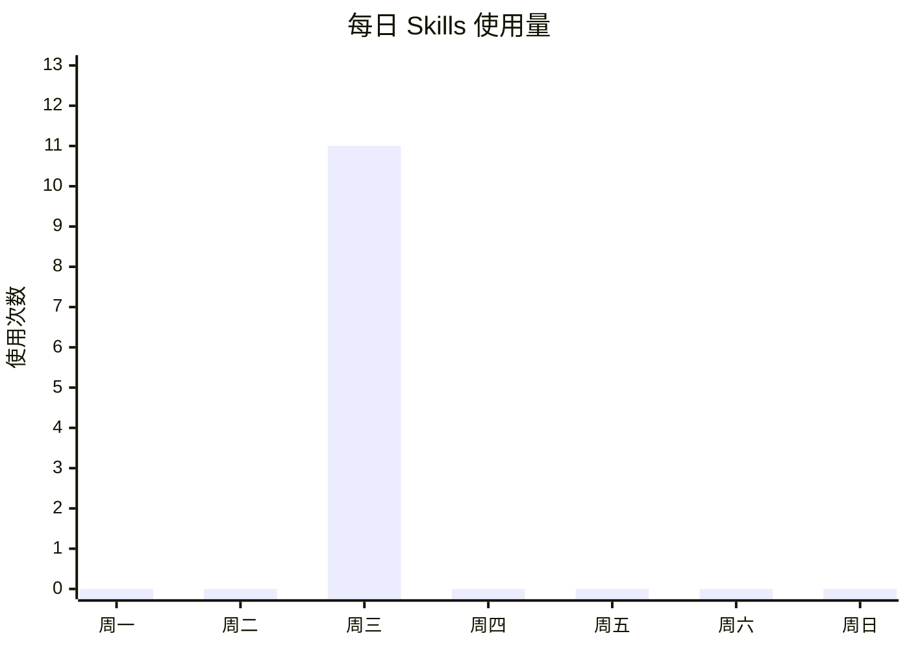
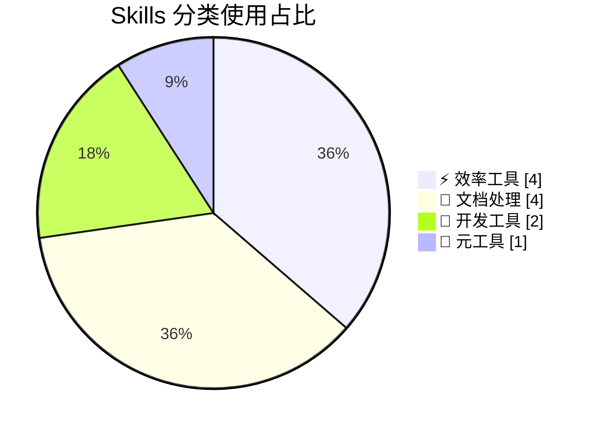

# 📊 Skills 周报 — W12

> **统计周期**: 2026-03-16 ~ 2026-03-22
> **生成时间**: 2026-03-18 13:40

---

## 📈 本周概览

> [!summary] 数据速览
> | 指标 | 数值 |
> |------|------|
> | 📦 总使用次数 | **11** |
> | 🧩 涉及 Skills | **6** 个 |
> | 📁 涉及分类 | **4** 个 |
> | 📅 活跃天数 | **1** 天 |
> | 📝 日志文件数 | **2** 个 |

---

## 🏅 Skills 排行榜

| 排名 | Skill | 使用次数 | 热度 | 分类 |
|:----:|-------|:--------:|------|------|
| 🥇 | 🧠 **memory-management** | 3 | ██████████ | 效率工具 |
| 🥈 | 📝 **doc-coauthoring** | 3 | ██████████ | 文档处理 |
| 🥉 | 🎨 **frontend-design** | 2 | ██████░░░░ | 开发工具 |
|  4  | 📊 **planning-with-files** | 1 | ███░░░░░░░ | 效率工具 |
|  5  | 📊 **xlsx** | 1 | ███░░░░░░░ | 文档处理 |
|  6  | ⚙️ **skill-creator** | 1 | ███░░░░░░░ | 元工具 |

---

## 📊 可视化

### 每日使用趋势

### 分类使用占比

### 分类明细

| 分类 | 次数 | 占比 | 分布 |
|------|:----:|:----:|------|
| ⚡ **效率工具** | 4 | 36% | █████░░░░░░░░░░ |
| 📄 **文档处理** | 4 | 36% | █████░░░░░░░░░░ |
| 🔧 **开发工具** | 2 | 18% | ██░░░░░░░░░░░░░ |
| 🔩 **元工具** | 1 | 9% | █░░░░░░░░░░░░░░ |

---

## 🧠 智能洞察

> [!tip] AI 分析
> - 🏆 **本周 MVP**: 🧠 `memory-management`，使用了 **3** 次
> - 📂 **最活跃分类**: ⚡ 效率工具，共 4 次
> - 💡 **待探索**: 还有 **16** 个 Skill 本周未使用，考虑试试 `slack-gif-creator`, `markitdown`, `webapp-testing`？
> - 📅 **活跃天数**: 1 天使用了 Skills
> - 🌈 **多样性指数**: 27%（使用了 6/22 个 Skills）

---

## 🔍 Skill × 问题 明细

> 每个 Skill 本周解决了哪些具体问题？

### 🧠 memory-management

- **`2026-03-18`** — 知识库目录重构：工作/学习分离
  - 将原有结构重构为工作和学习分离的新架构：
- **`2026-03-18`** — 新增 40_Projects 个人项目目录
  - 知识库新增 `40_Projects/` 目录，用于存放与工作无关的个人产品/Side Project。
- **`2026-03-18`** — Skills 使用量周报系统
  - 在知识库中搭建了 Skills 每周使用量统计 + 可视化周报系统。

### 📝 doc-coauthoring

- **`2026-03-18`** — 知识库目录重构：工作/学习分离
  - 将原有结构重构为工作和学习分离的新架构：
- **`2026-03-18`** — 游戏策划学习笔记
  - 在 `20_Study/游戏策划/读书笔记/` 下整理了两本书的详细读书笔记：
- **`2026-03-18`** — Skills 使用量周报系统
  - 在知识库中搭建了 Skills 每周使用量统计 + 可视化周报系统。

### 🎨 frontend-design

- **`2026-03-18`** — CaloriSnap v0.2 升级 — 咖啡因追踪 + UI 全面重设计
  - `01_产品设计/prototype.html` 从 v0.1 升级到 v0.2，主要变化：
- **`2026-03-18`** — CaloriSnap v0.2.1 配色更新 —「茶咖双生」
  - 配色从 v0.2 的「暖橙 + 青绿」升级为更 match 饮品健康主题的「焦糖棕 + 翡翠绿」：

### 📊 planning-with-files

- **`2026-03-18`** — CaloriSnap 项目启动
  - 在 `40_Projects/CaloriSnap/` 下创建了第一个个人项目——拍照识别奶茶/咖啡标签计算热量的健康管理工具。

### 📊 xlsx

- **`2026-03-18`** — CaloriSnap 热量数据库种子数据收集
  - 在 `40_Projects/CaloriSnap/02_技术方案/热量数据库-种子数据.md` 中整理了 8 大品牌的完整热量数据：

### ⚙️ skill-creator

- **`2026-03-18`** — Skills 使用量周报系统
  - 在知识库中搭建了 Skills 每周使用量统计 + 可视化周报系统。

---

## 🕐 每日时间线

#### 📅 2026-03-18 (周三)

- 🧠 **memory-management** ×3 — Skills 使用量周报系统、知识库目录重构：工作/学习分离、新增 40_Projects 个人项目目录
- 📝 **doc-coauthoring** ×3 — Skills 使用量周报系统、知识库目录重构：工作/学习分离、游戏策划学习笔记
- 🎨 **frontend-design** ×2 — CaloriSnap v0.2.1 配色更新 —「茶咖双生」、CaloriSnap v0.2 升级 — 咖啡因追踪 + U
- 📊 **planning-with-files** ×1 — CaloriSnap 项目启动
- 📊 **xlsx** ×1 — CaloriSnap 热量数据库种子数据收集
- ⚙️ **skill-creator** ×1 — Skills 使用量周报系统

---

## 📋 完整 Skills 使用清单

> [!info] 全部 22 个已安装 Skills

| Skill | 分类 | 本周 | 状态 |
|-------|------|:----:|------|
| 🎨 algorithmic-art | 创意设计 | 0 | ⬜ 未使用 |
| 🏷️ brand-guidelines | 创意设计 | 0 | ⬜ 未使用 |
| 🖼️ canvas-design | 创意设计 | 0 | ⬜ 未使用 |
| 🔌 claude-api | 开发工具 | 0 | ⬜ 未使用 |
| 📝 doc-coauthoring | 文档处理 | 3 | ✅ 3次 |
| 📄 docx | 文档处理 | 0 | ⬜ 未使用 |
| 🎨 frontend-design | 开发工具 | 2 | ✅ 2次 |
| 📢 internal-comms | 沟通协作 | 0 | ⬜ 未使用 |
| 📋 markitdown | 文档处理 | 0 | ⬜ 未使用 |
| 🔧 mcp-builder | 开发工具 | 0 | ⬜ 未使用 |
| 🧠 memory-management | 效率工具 | 3 | ✅ 3次 |
| 📕 pdf | 文档处理 | 0 | ⬜ 未使用 |
| 📊 planning-with-files | 效率工具 | 1 | ✅ 1次 |
| 📽️ pptx | 文档处理 | 0 | ⬜ 未使用 |
| 🔄 self-improving-agent | 效率工具 | 0 | ⬜ 未使用 |
| ⚙️ skill-creator | 元工具 | 1 | ✅ 1次 |
| 🎬 slack-gif-creator | 创意设计 | 0 | ⬜ 未使用 |
| 🎭 theme-factory | 创意设计 | 0 | ⬜ 未使用 |
| ⚡ using-superpowers | 元工具 | 0 | ⬜ 未使用 |
| 🌐 web-artifacts-builder | 开发工具 | 0 | ⬜ 未使用 |
| 🧪 webapp-testing | 开发工具 | 0 | ⬜ 未使用 |
| 📊 xlsx | 文档处理 | 1 | ✅ 1次 |

---

🤖 由 CodeBuddy Skills Tracker 自动生成 | 2026-03-18 13:40

