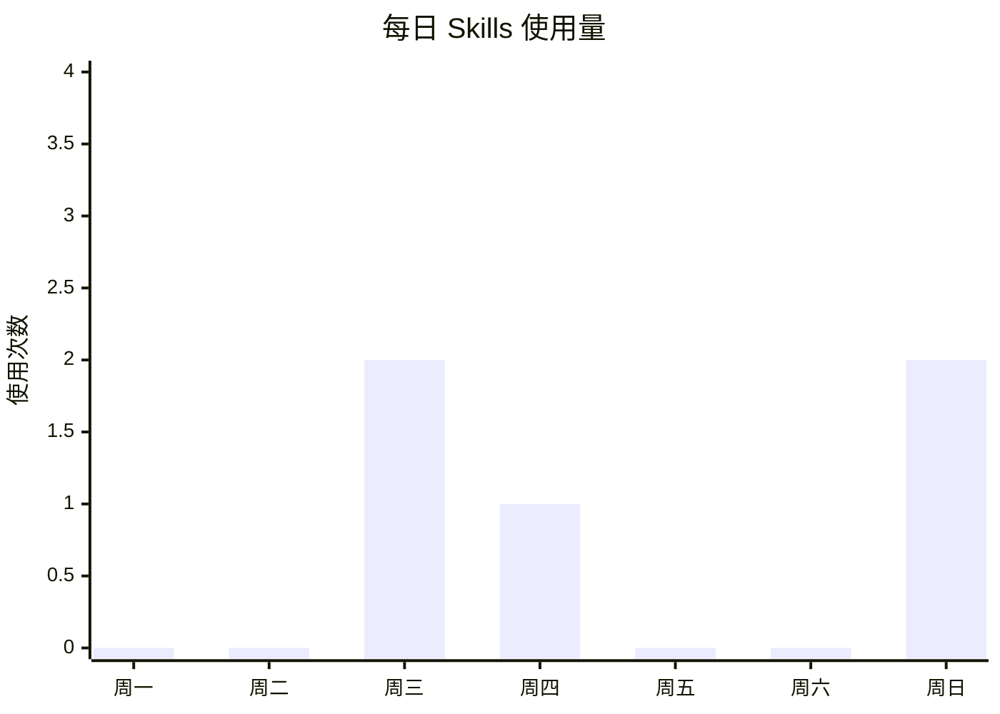
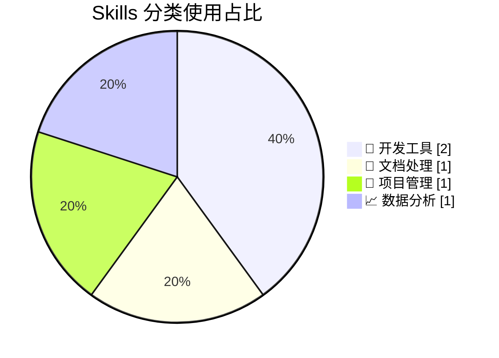

# 📊 Skills 周报 — W12

> **统计周期**: 2026-03-16 ~ 2026-03-22
> **生成时间**: 2026-03-23 17:28

---

## 📈 本周概览

> [!summary] 数据速览
> | 指标 | 数值 |
> |------|------|
> | 📦 总使用次数 | **5** |
> | 🧩 涉及 Skills | **4** 个 |
> | 📁 涉及分类 | **4** 个 |
> | 📅 活跃天数 | **3** 天 |
> | 📝 日志文件数 | **5** 个 |

---

## 🏅 Skills 排行榜

| 排名 | Skill | 使用次数 | 热度 | 分类 |
|:----:|-------|:--------:|------|------|
| 🥇 | 🎨 **frontend-design** | 2 | ██████████ | 开发工具 |
| 🥈 | 📝 **doc-coauthoring** | 1 | █████░░░░░ | 文档处理 |
| 🥉 | 🐑 **project-shepherd** | 1 | █████░░░░░ | 项目管理 |
|  4  | 📈 **data-analyst** | 1 | █████░░░░░ | 数据分析 |

---

## 📊 可视化

### 每日使用趋势

```mermaid
xychart-beta
    title "每日 Skills 使用量"
    x-axis ["周一", "周二", "周三", "周四", "周五", "周六", "周日"]
    y-axis "使用次数" 0 --> 4
    bar [0, 0, 2, 1, 0, 0, 2]
```

### 分类使用占比

```mermaid
pie showData
    title Skills 分类使用占比
    "🔧 开发工具" : 2
    "📄 文档处理" : 1
    "🐑 项目管理" : 1
    "📈 数据分析" : 1
```

### 分类明细

| 分类 | 次数 | 占比 | 分布 |
|------|:----:|:----:|------|
| 🔧 **开发工具** | 2 | 40% | ██████░░░░░░░░░ |
| 📄 **文档处理** | 1 | 20% | ███░░░░░░░░░░░░ |
| 🐑 **项目管理** | 1 | 20% | ███░░░░░░░░░░░░ |
| 📈 **数据分析** | 1 | 20% | ███░░░░░░░░░░░░ |

---

## 🧠 智能洞察

> [!tip] AI 分析
> - 🏆 **本周 MVP**: 🎨 `frontend-design`，使用了 **2** 次
> - 📂 **最活跃分类**: 🔧 开发工具，共 2 次
> - 💡 **待探索**: 还有 **23** 个 Skill 本周未使用，考虑试试 `webapp-testing`, `pptx`, `using-superpowers`？
> - 📅 **活跃天数**: 3 天使用了 Skills
> - 🌈 **多样性指数**: 15%（使用了 4/27 个 Skills）

---

## 🔍 Skill × 问题 明细

> 每个 Skill 本周解决了哪些具体问题？

### 🎨 frontend-design

- **`2026-03-18`** — CaloriSnap v0.2 升级 — 咖啡因追踪 + UI 全面重设计
  - `01_产品设计/prototype.html` 从 v0.1 升级到 v0.2，主要变化：
- **`2026-03-18`** — CaloriSnap v0.3 — 第一性原理 Review + 全面重构
  - 用第一性原理和批判性思维 review 了 v0.2 原型，发现 6 类问题后全面重构升级到 v0.3。

### 📝 doc-coauthoring

- **`2026-03-19`** — 《游戏设计艺术》课程化
  - 将 `20_Study/游戏策划/读书笔记/游戏设计艺术.md` 的单文件读书笔记扩展为完整的课程体系，每章一个独立md文件，深入还原原书细节。

### 🐑 project-shepherd

- **`2026-03-22`** — 「异人体检站」开发准备 — 进入开发流程
  - 1. **Kick-off 启动会材料**：一页纸项目概览 + 60 分钟会议议程 + 5 项必须达成共识 → `异人体检站_Kickoff_启动会.md`

### 📈 data-analyst

- **`2026-03-22`** — UC 对局复盘 — 【有待提升】指标数字覆盖率分析
  - Skills: data-analyst

---

## 🕐 每日时间线

#### 📅 2026-03-18 (周三)

- 🎨 **frontend-design** ×2 — CaloriSnap v0.3 — 第一性原理 Review、CaloriSnap v0.2 升级 — 咖啡因追踪 + U

#### 📅 2026-03-19 (周四)

- 📝 **doc-coauthoring** ×1 — 《游戏设计艺术》课程化

#### 📅 2026-03-22 (周日)

- 🐑 **project-shepherd** ×1 — 「异人体检站」开发准备 — 进入开发流程
- 📈 **data-analyst** ×1 — UC 对局复盘 — 【有待提升】指标数字覆盖率分析

---

## 📋 完整 Skills 使用清单

> [!info] 全部 27 个已安装 Skills

| Skill | 分类 | 本周 | 状态 |
|-------|------|:----:|------|
| 🎨 algorithmic-art | 创意设计 | 0 | ⬜ 未使用 |
| 🏷️ brand-guidelines | 创意设计 | 0 | ⬜ 未使用 |
| 🖼️ canvas-design | 创意设计 | 0 | ⬜ 未使用 |
| 🔌 claude-api | 开发工具 | 0 | ⬜ 未使用 |
| 📈 data-analyst | 数据分析 | 1 | ✅ 1次 |
| 📝 doc-coauthoring | 文档处理 | 1 | ✅ 1次 |
| 📄 docx | 文档处理 | 0 | ⬜ 未使用 |
| 🎨 frontend-design | 开发工具 | 2 | ✅ 2次 |
| 🎮 game-designer | 产品设计 | 0 | ⬜ 未使用 |
| 📢 internal-comms | 沟通协作 | 0 | ⬜ 未使用 |
| 📣 marketing-strategist | 营销策略 | 0 | ⬜ 未使用 |
| 📋 markitdown | 文档处理 | 0 | ⬜ 未使用 |
| 🔧 mcp-builder | 开发工具 | 0 | ⬜ 未使用 |
| 🧠 memory-management | 效率工具 | 0 | ⬜ 未使用 |
| 📕 pdf | 文档处理 | 0 | ⬜ 未使用 |
| 📊 planning-with-files | 效率工具 | 0 | ⬜ 未使用 |
| 📽️ pptx | 文档处理 | 0 | ⬜ 未使用 |
| 📋 product-manager | 产品设计 | 0 | ⬜ 未使用 |
| 🐑 project-shepherd | 项目管理 | 1 | ✅ 1次 |
| 🔄 self-improving-agent | 效率工具 | 0 | ⬜ 未使用 |
| ⚙️ skill-creator | 元工具 | 0 | ⬜ 未使用 |
| 🎬 slack-gif-creator | 创意设计 | 0 | ⬜ 未使用 |
| 🎭 theme-factory | 创意设计 | 0 | ⬜ 未使用 |
| ⚡ using-superpowers | 元工具 | 0 | ⬜ 未使用 |
| 🌐 web-artifacts-builder | 开发工具 | 0 | ⬜ 未使用 |
| 🧪 webapp-testing | 开发工具 | 0 | ⬜ 未使用 |
| 📊 xlsx | 文档处理 | 0 | ⬜ 未使用 |

---

🤖 由 CodeBuddy Skills Tracker 自动生成 | 2026-03-23 17:28

